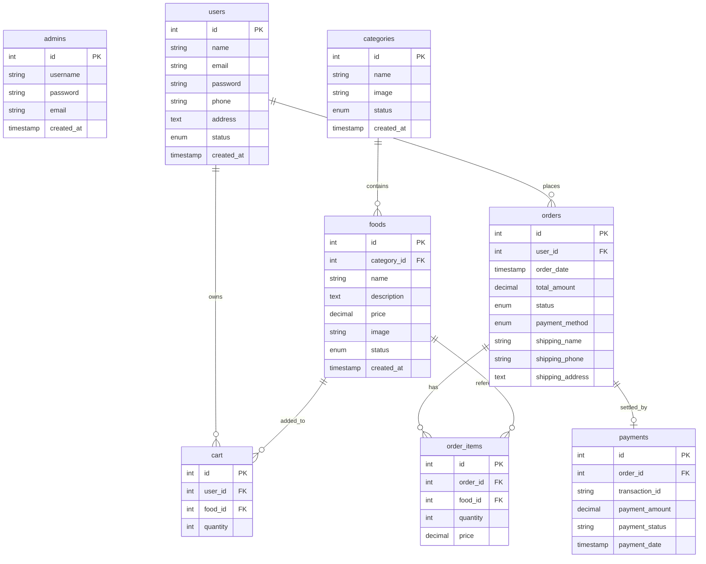

# FoodExpress - Complete Installation & Setup Guide

Welcome to the **FoodExpress** Food Ordering System! This project is designed for local development on Windows using XAMPP (Apache, MySQL, PHP).

---

## 📂 Folder Structure

The project directory is structured as follows:

```text
FoodExpress/
├── config/
│   └── db.php                  # MySQLi connection & prepared statement wrappers
├── includes/
│   ├── auth.php                # Customer session verification helpers
│   ├── header.php              # Customer portal nav bar template
│   └── footer.php              # Customer portal script wrappers & footer template
├── admin/
│   ├── includes/
│   │   ├── header.php          # Admin side-bar navigation layout
│   │   ├── footer.php          # Admin script templates & footer
│   │   └── fpdf.php            # Official FPDF single-file PDF class
│   ├── index.php               # Admin login form
│   ├── dashboard.php           # Admin analytics overview dashboard (Chart.js)
│   ├── categories.php          # Categories panel (CRUD view)
│   ├── category-process.php    # Category processing (uploads/inserts/deletes)
│   ├── foods.php               # Food menu panel (CRUD view)
│   ├── food-process.php        # Food processing (uploads/inserts/deletes)
│   ├── users.php               # User blocking/unblocking accounts list
│   ├── orders.php              # Orders management page with status shifts
│   ├── sales-report.php        # Dynamic filterable sales timeline reports
│   ├── generate-pdf.php        # Printable PDF invoice bills (FPDF)
│   ├── profile.php             # Admin credentials settings update
│   └── logout.php              # Admin logout script
├── assets/
│   ├── css/
│   │   ├── style.css           # Customer layout custom styles
│   │   └── admin.css           # Admin dashboard layout styles
│   ├── js/
│   │   └── main.js             # Cart updates AJAX logic & customer scripting
│   └── uploads/
│       ├── foods/              # Uploaded food items images
│       └── categories/         # Uploaded category folder images
├── database/
│   └── database.sql            # Full MySQL schema script & seeds
├── index.php                   # Homepage containing featured items & search
├── categories.php              # All food categories listing grid
├── category-foods.php          # Filtered food items category list
├── food-details.php            # Single food details page with qty adder
├── search.php                  # Full textual LIKE search query pages
├── register.php                # Customer registration validation
├── login.php                   # Customer login authentication
├── profile.php                 # Customer profile update & password checks
├── cart.php                    # Product list shopping cart table
├── cart-action.php             # AJAX cart dispatcher
├── checkout.php                # Shipping details form (COD/PayPal options)
├── paypal-payment.php          # Smart PayPal client token receiver
├── order-success.php           # Order confirmed checkout receipt screen
├── orders.php                  # Collapsible order history table
├── track-order.php             # Visual progress delivery order tracking
├── logout.php                  # User logout script
└── INSTALL.md                  # Installation guide (This document)
```

---

## 🛠️ Installation Guide

Follow these steps to deploy and test the system locally on your computer:

### Step 1: Install XAMPP
Download and install [XAMPP](https://www.apachefriends.org/) on your system, ensuring you select **Apache**, **MySQL**, and **PHP**.

### Step 2: Copy Project Directory
Copy the entire **FoodExpress** folder and paste it under the XAMPP web root directory, typically:
`C:\xampp\htdocs\FoodExpress\` (or `D:\xampp\htdocs\FoodExpress\` depending on your installation).

### Step 3: Run XAMPP Control Panel
Open the XAMPP Control Panel and start **Apache** and **MySQL** services.

### Step 4: Access Database Setup
Our database connection file contains an **auto-setup script**. It will automatically attempt to create the database named `foodexpress` and import all the schema tables and seed data upon your first page load!

If you prefer to import the database manually:
1. Open your browser and navigate to: [http://localhost/phpmyadmin/](http://localhost/phpmyadmin/)
2. Click on the **SQL** tab.
3. Open `database/database.sql` in a text editor, copy its contents, paste them into phpMyAdmin's SQL query box, and click **Go**.

### Step 5: Test the Application
Open your browser and navigate to the application:
* **Customer Portal**: [http://localhost/FoodExpress/index.php](http://localhost/FoodExpress/index.php)
* **Admin Portal**: [http://localhost/FoodExpress/admin/index.php](http://localhost/FoodExpress/admin/index.php)

---

## 🔑 Default Credentials

### Admin (Restaurant Owner)
* **Username**: `admin`
* **Password**: `admin123`

### Customers (Sample Data)
* **Email**: `john@example.com`
* **Password**: `password123`
* **Email**: `jane@example.com`
* **Password**: `password123`

---

## 📊 Database Entity-Relationship (ER) Diagram


